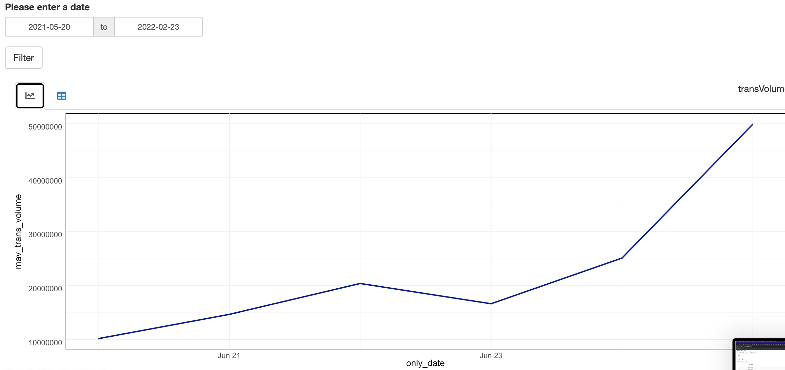
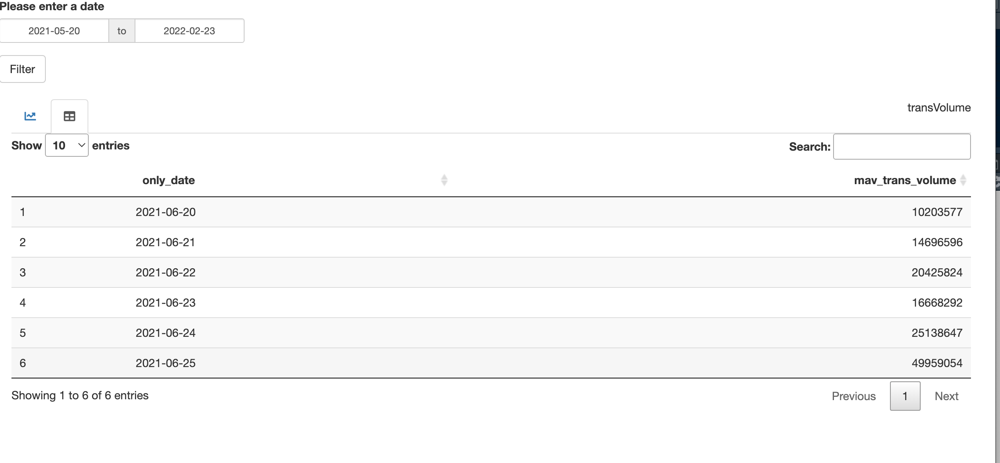

# sales_dashboard
## Brief description;
Using shiny, ggplot2, datatable, dplyr etc... packages to make a dashboard for sales. And using modularization to simplify the code.

#the results should be as below:

